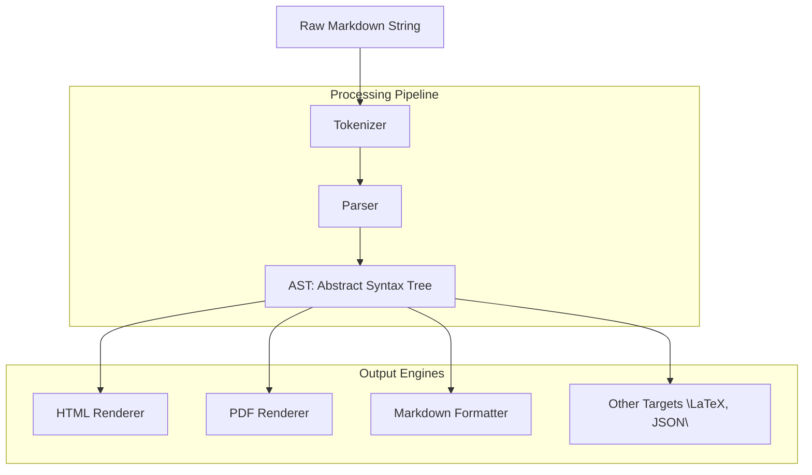

# DocMorph

[](https://pypi.org/project/docmorph/)
[](https://pypi.org/project/docmorph/)
[](https://github.com/rafaeljohn9/DocMorph/stargazers)
[](https://github.com/rafaeljohn9/DocMorph/blob/main/LICENSE)

**DocMorph** is a powerful and flexible Markdown processing library that transforms raw Markdown strings into multiple output formats, including HTML, PDF, LaTeX, and more. Built for developers, DocMorph provides a robust pipeline for parsing, analyzing, and rendering Markdown documents with ease.

## Features

- **Flexible Parsing:** Converts Markdown to an Abstract Syntax Tree (AST) for advanced processing.
- **Multiple Output Formats:** Render to HTML, PDF, Markdown, LaTeX, JSON, and more.
- **Extensible Pipeline:** Easily add custom output engines or processing steps.
- **Open Source:** MIT licensed and actively maintained.

## Processing Pipeline



## Installation

Install DocMorph from [PyPI](https://pypi.org/project/docmorph/):

```bash
pip install docmorph
```

## Quick Start

```python
import docmorph

markdown_text = "# Hello, DocMorph!"
html = docmorph.to_html(markdown_text)
print(html)
```

## Documentation

- [API Reference](https://github.com/rafaeljohn9/DocMorph#api-reference)
- [Examples](https://github.com/rafaeljohn9/DocMorph/tree/main/examples)
- [Issues](https://github.com/rafaeljohn9/DocMorph/issues)

## Contributing

Contributions are welcome! Please see our [contributing guidelines](https://github.com/rafaeljohn9/DocMorph/blob/main/CONTRIBUTING.md).

## License

This project is licensed under the [MIT License](https://github.com/rafaeljohn9/DocMorph/blob/main/LICENSE).

---

⭐ Star [DocMorph on GitHub](https://github.com/rafaeljohn9/DocMorph) to support the project!
